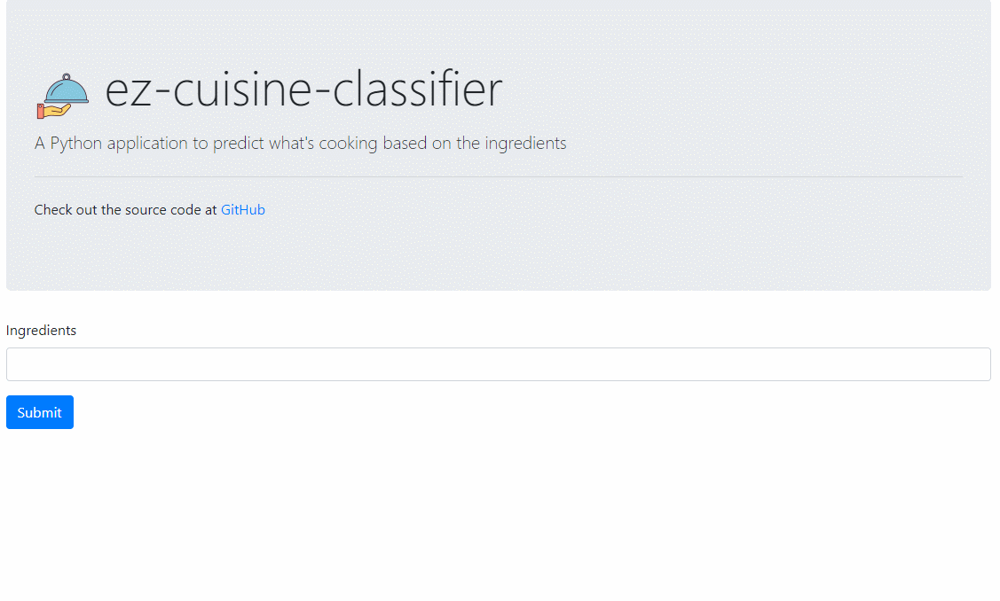

    

# ez-cuisine-classifier

A Python application to predict what is cooking

## Environment

- Python 3.9
- Windows 10

## Install

    python -m venv venv
    .\venv\Scripts\activate
    python -m pip install -U pip
    pip install -r requirements-dev.txt

## Data Source

The training data is from kaggle's [Recipe Ingredients Dataset](https://www.kaggle.com/kaggle/recipe-ingredients-dataset).

## Demo

## Credits

- [Logo][1] by [Design Zone][2]

[1]: https://iconstore.co/icons/cafes-vector-icon-set/
[2]: https://iconstore.co/author/design-zone/
